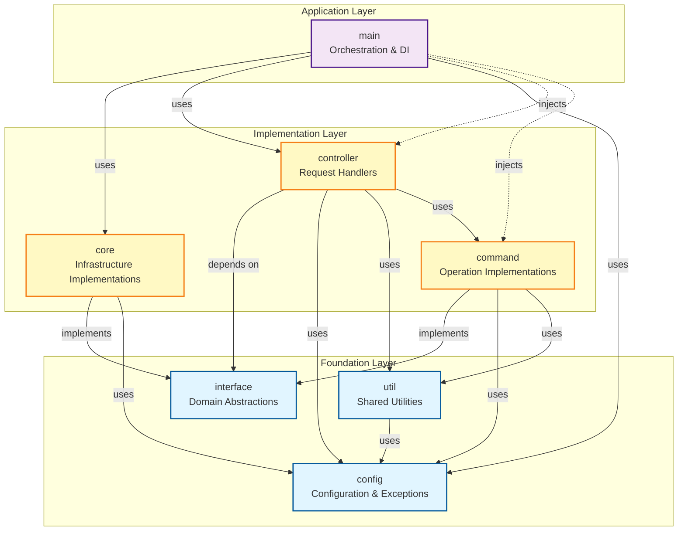

# Declusor Architecture

Declusor is a command-and-control (C2) framework built with clean architecture principles, emphasizing separation of concerns, dependency inversion, and modularity. The architecture follows a layered approach where dependencies flow inward toward domain abstractions, ensuring maintainability and testability.

## Architectural Principles

### 1. Dependency Inversion
- High-level modules depend on abstractions, not concrete implementations
- The `interface` package defines domain contracts that all implementations must follow
- Core infrastructure implements these abstractions without coupling to application logic

### 2. Separation of Concerns
- Each package has a single, well-defined responsibility
- Business logic is isolated from infrastructure concerns
- Application orchestration is separated from implementation details

### 3. Dependency Injection
- The `main` package acts as the composition root
- Dependencies are injected at runtime, not hardcoded
- Controllers receive all required dependencies as parameters

## Layer Architecture

**Legend:**
- **Solid arrows**: Compile-time dependencies (imports)
- **Dashed arrows**: Runtime dependency injection

## Package Responsibilities

### Foundation Layer

#### `interface` (Domain Layer)
- **Purpose**: Defines abstract contracts for all system components
- **Dependencies**: None (only standard library)

#### `config`
- **Purpose**: Centralized configuration, constants, and exception hierarchy
- **Dependencies**: None (only standard library)

#### `util`
- **Purpose**: Stateless utility functions used across all layers
- **Dependencies**: `config` only

### Implementation Layer

#### `core`
- **Purpose**: Concrete implementations of domain interfaces
- **Dependencies**: `interface`, `config`

#### `command`
- **Purpose**: Executable operations performed on remote targets
- **Dependencies**: `interface`, `config`, `util`
- **Pattern**: Command design pattern

#### `controller`
- **Purpose**: Request handlers that orchestrate command execution
- **Dependencies**: `interface`, `config`, `util`, `command`

### Application Layer

#### `main`
- **Purpose**: Application bootstrap and dependency injection
- **Dependencies**: `core`, `controller`, `config`

## Design Decisions

### Why `main` depends on `core` (not vice versa)?
- Prevents infrastructure from knowing about application orchestration
- Allows core components to be reused in different contexts
- Follows the Dependency Inversion Principle

### Why controllers depend on `interface` instead of `core`?
- Controllers don't need to know about concrete implementations
- Enables dependency injection of any implementation
- Improves testability and flexibility

### Why separate `command` from `controller`?
- Commands encapsulate operations (what to do)
- Controllers handle requests (when to do it)
- Separation allows command reuse across different controllers

### Why `util` is separate?
- Provides cross-cutting concerns without creating coupling
- Stateless functions can be used anywhere
- Only depends on `config`, avoiding circular dependencies

## Extension Points

To extend the system:

1. **Add a new command**: Create a class implementing `ICommand` in the `command` package
2. **Add a new controller**: Create a function with the `MetaController` signature in the `controller` package
3. **Add a new interface**: Define an abstract base class in the `interface` package
4. **Add a new implementation**: Implement the interface in the `core` package
5. **Register the route**: Wire the controller in `main/service.py`
